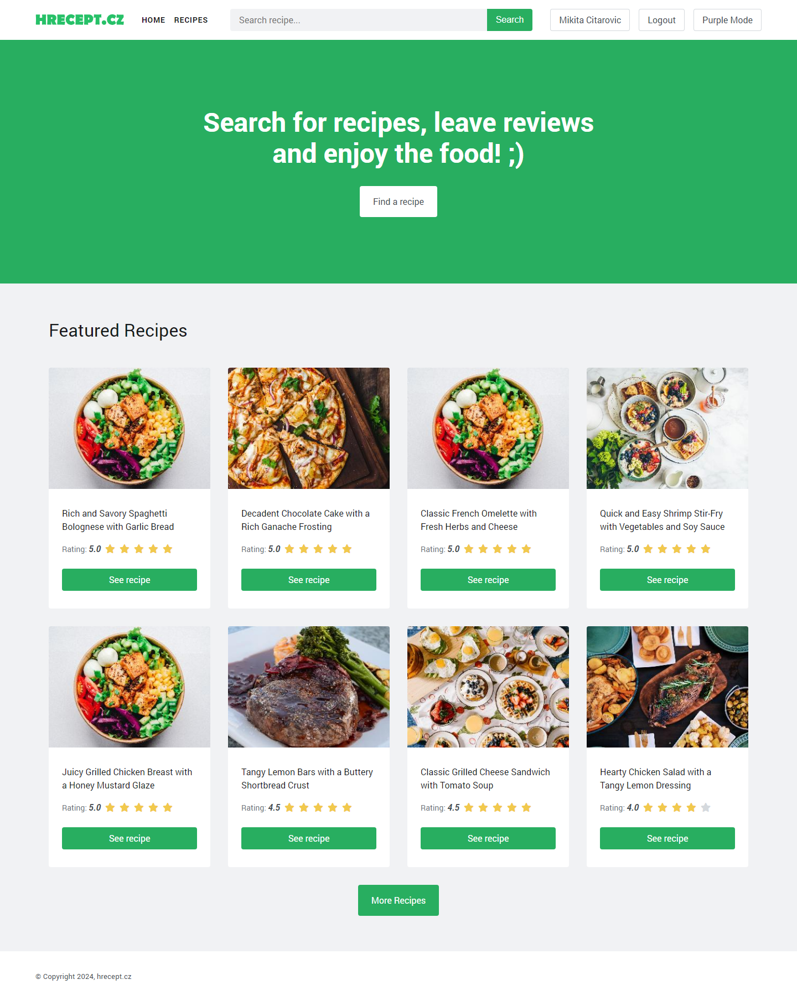
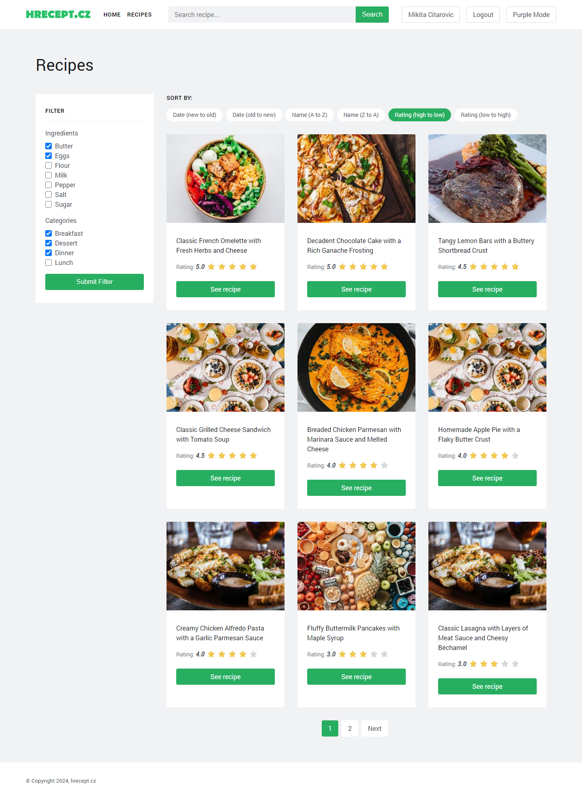
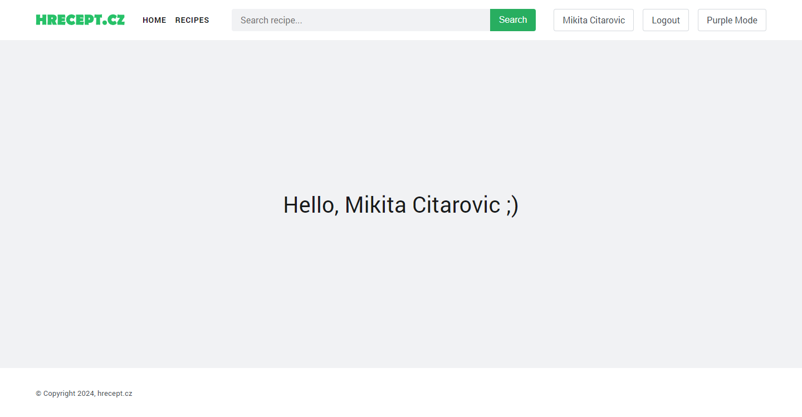
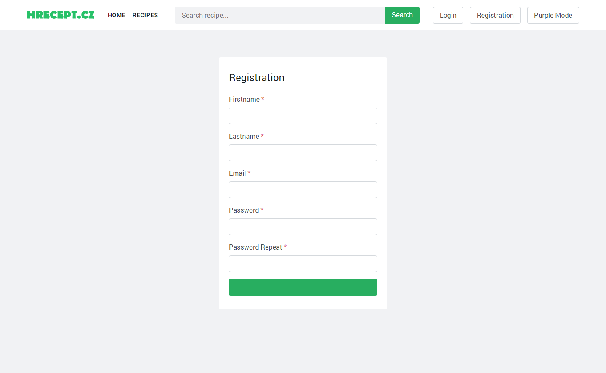

# Recipe Selection Service

## Description

Recipe Selection Service is a web application that allows users to search for recipes based on available ingredients and by dish type. Users can search for recipes and leave reviews on them. Administrators can add new recipes. This project was completed as part of the semester project in the [Foundations of Web Applications](https://intranet.fel.cvut.cz/en/education/bk/predmety/31/29/p3129506.html) course at [CTU in Prague](https://www.cvut.cz/).

## Table of Contents

- [Description](#description)
- [Technical Requirements](#technical-requirements)
- [Installation and Setup](#installation-and-setup)
- [Usage](#usage)
- [Architecture and Technologies](#architecture-and-technologies)
- [Features](#features)
- [Authors](#authors)
- [License](#license)
- [Screenshots](#screenshots)

## Technical Requirements

To run this project, you will need NodeJS and npm. All dependencies are listed in the `package.json` file. This is necessary to build the frontend. The tested versions were NodeJS v21.7.1 and npm 10.5.0. Additionally, you will need Docker to run the backend.

## Installation and Setup

1. Clone the repository to your computer.
2. Navigate to the project folder.
3. Install the frontend dependencies:
    ```sh
    npm install
    ```
4. Build the frontend:
    ```sh
    npm run build
    ```
5. Start the backend:
    ```sh
    docker-compose up
    ```
6. Open the page `http://localhost:80` in your browser.
7. To stop the backend, run the command:
    ```sh
    docker-compose down
    ```

## Usage

To add new recipes, you need to log in as an administrator. On the login page, enter the username `admin@example.com` and the password `adminadmin`. After logging in as an administrator, a "Add Recipe" button will appear at the top of the site.

## Architecture and Technologies

For naming CSS styles, the [BEM methodology](https://en.bem.info/methodology/) was used. SCSS preprocessor was used for styling. Babel was used to transpile JavaScript code. Gulp was used as the task manager to build the project.

The backend was written in PHP without using any frameworks but was inspired by them. The MVC pattern was used in designing the backend. PostgreSQL was chosen as the database.

## Features

- Adding new recipes with photos.
- Viewing a list of recipes with pagination, filtering, and sorting.
- Searching for recipes by name.
- Viewing detailed recipe information.
- Posting reviews on recipes.

## Authors

- [Mikita Citarovič](https://github.com/mikicit)

## License

MIT License

Copyright (c) 2024 Mikita A Citarovič

Permission is hereby granted, free of charge, to any person obtaining a copy
of this software and associated documentation files (the "Software"), to deal
in the Software without restriction, including without limitation the rights
to use, copy, modify, merge, publish, distribute, sublicense, and/or sell
copies of the Software, and to permit persons to whom the Software is
furnished to do so, subject to the following conditions:

The above copyright notice and this permission notice shall be included in all
copies or substantial portions of the Software.

THE SOFTWARE IS PROVIDED "AS IS", WITHOUT WARRANTY OF ANY KIND, EXPRESS OR
IMPLIED, INCLUDING BUT NOT LIMITED TO THE WARRANTIES OF MERCHANTABILITY,
FITNESS FOR A PARTICULAR PURPOSE AND NONINFRINGEMENT. IN NO EVENT SHALL THE
AUTHORS OR COPYRIGHT HOLDERS BE LIABLE FOR ANY CLAIM, DAMAGES OR OTHER
LIABILITY, WHETHER IN AN ACTION OF CONTRACT, TORT OR OTHERWISE, ARISING FROM,
OUT OF OR IN CONNECTION WITH THE SOFTWARE OR THE USE OR OTHER DEALINGS IN THE
SOFTWARE.

## Screenshots









